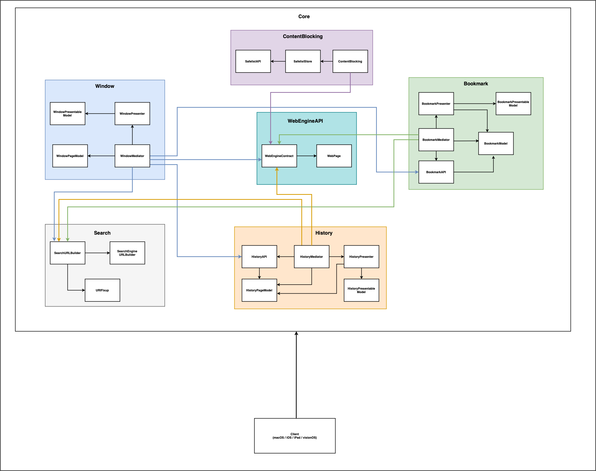

# web-browser

Web browser for iOS | macOS | visionOS

## Building the code

1. Install the latest Xcode developer tools from Apple.
2. Clone the repository.
3. Build the `web-browser` scheme in Xcode.

## Services Library Architecture
The Services library encompasses all shared code between iOS, macOS, and visionOS. It is designed to be entirely independent of SwiftUI, enabling seamless migration to other UI frameworks or support for platforms beyond Apple's ecosystem.

The library is organized into folders, each representing a "sub-module" of the system. While these sub-modules are located within the same directory, they are conceptually treated as distinct modules to promote modularity and maintainability. 

### WebEngineAPI
The WebEngineAPI defines a set of interfaces that serve as the communication layer between the system components and the web engine. These interfaces abstract the functionality of the web engine, ensuring that system components never interact directly with the engine itself.

For instance, while WebKit is the web engine used in this project, components within the library communicate only through the defined interfaces, maintaining a clean separation of concerns and promoting flexibility for future changes. 

### WebKitEngine
The WebKitEngine module contains all code specific to WebKit. It serves as a wrapper around WebKit, decoupling the library from the engine and enabling easier migration to alternative web engines in the future.

This module is the sole location within the library where WebKit-specific code resides, ensuring a clear separation of engine-specific logic from the rest of the project. 

### Search
The Search module handles the logic for interpreting user input in the address bar. It determines whether the entered text is a valid URI or plain text.

- If the input is a valid URI, the user is redirected to the specified address.
- If the input is not a valid URI, it defaults to performing a Google Search (currently) for the text.

This approach ensures a seamless experience for users, whether they enter a web address or a search query.

### Content Blocking
The Content Blocking module manages the logic for enforcing restrictions on websites. It includes rules designed to block cookies, cryptocurrency mining, fingerprinting, and other potentially intrusive activities.

The rules are categorized into two levels:

- Basic: Applies minimal restrictions for a balanced browsing experience.
- Strict: Enforces comprehensive restrictions for enhanced privacy and security.

Additionally, the module features a safelist, allowing users to add exceptions for specific websites where restrictions should not be applied.

### Bookmarks
The Bookmarks module provides functionality for saving, organizing, and managing favorite websites. Users can add, delete (missing edit and reorder) bookmarks for quick access to frequently visited pages. The module ensures that bookmarks are stored persistently across sessions, offering a seamless user experience.

### History
The History module tracks and manages the user's browsing activity. It records visited websites chronologically, allowing users to review or revisit previously accessed pages. The module also includes functionality to search and delete entries, giving users full control over their browsing history.
