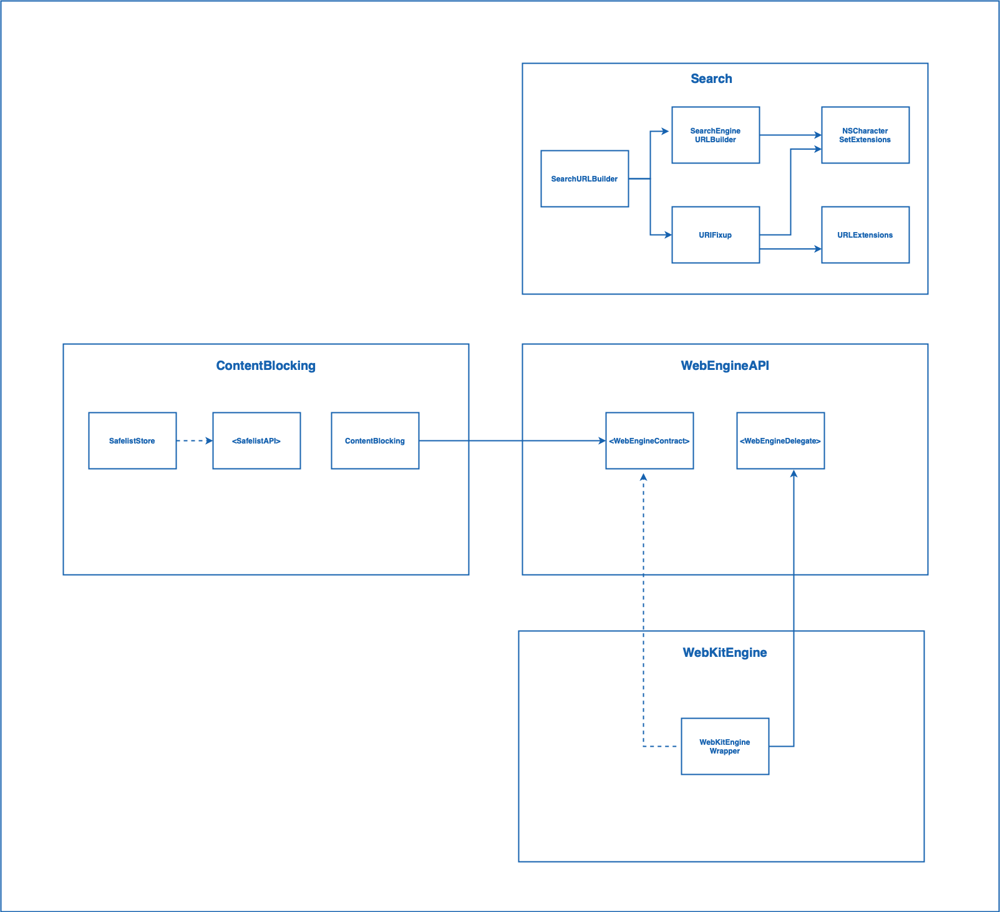
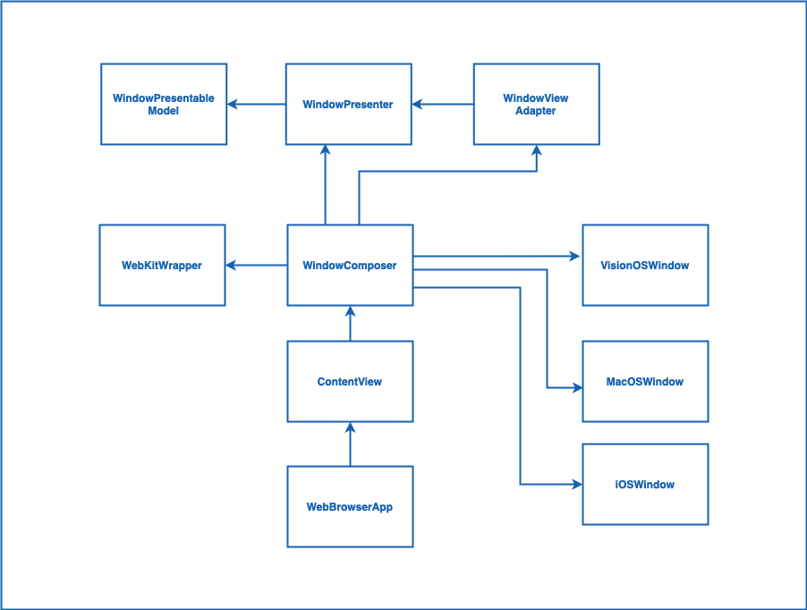

# web-browser

Web browser for iOS | macOS | visionOS

## Building the code

1. Install the latest Xcode developer tools from Apple.
2. Clone the repository.
3. Build the `web-browser` scheme in Xcode.

## Core Library Architecture
Contains all the code shared between iOS, macOS, and VisionOS. This library is completely decoupled from SwiftUI to facilitate future migrations to other UI frameworks or support other platforms outside Apple's ecosystem. 
This library is separated by folders representing "sub-modules" in the system. The idea is to treat them as actual modules, although they reside in the same place. 

### WebEngineAPI
Contains a set of interfaces that all the components of the system should use to communicate with the web engine. Those interfaces represent the web engine, but we don't talk directly with those engines. For example, WebKit is the web engine in this project, but all the components from this library don't talk directly to it; they only talk through the interfaces. 

### WebKitEngine
Contains all the code related to Webkit. It is basically a wrapper for Webkit that decouples this project from this library and facilitates future migrations to other engines. This is the only place in this library that contains code related to Webkit. 

### Search
Contains logic that verifies whether the text typed by the user is a real URI or just plain text. If it's a valid URI, it redirects the user to the desired address; if not, it uses Google Search (at the moment)to search for the text.

### Content Blocking
Contains logic to apply restrictions on a website. It has rules to block cookies, crypto mining, fingerprints, and other activities. Those rules are applied by level(basic and strict). It also contains a safelist for adding exceptions to certain websites. 

## Client App Architecture

### Window
Contains all the logic and state of the current window. Things like whether a page is loading or whether a website protection button should appear or not, for example, reside here. All user interactions go through here as well. If the users start typing, tap on the back/forward button, and add a website to the safelist, for example. 

