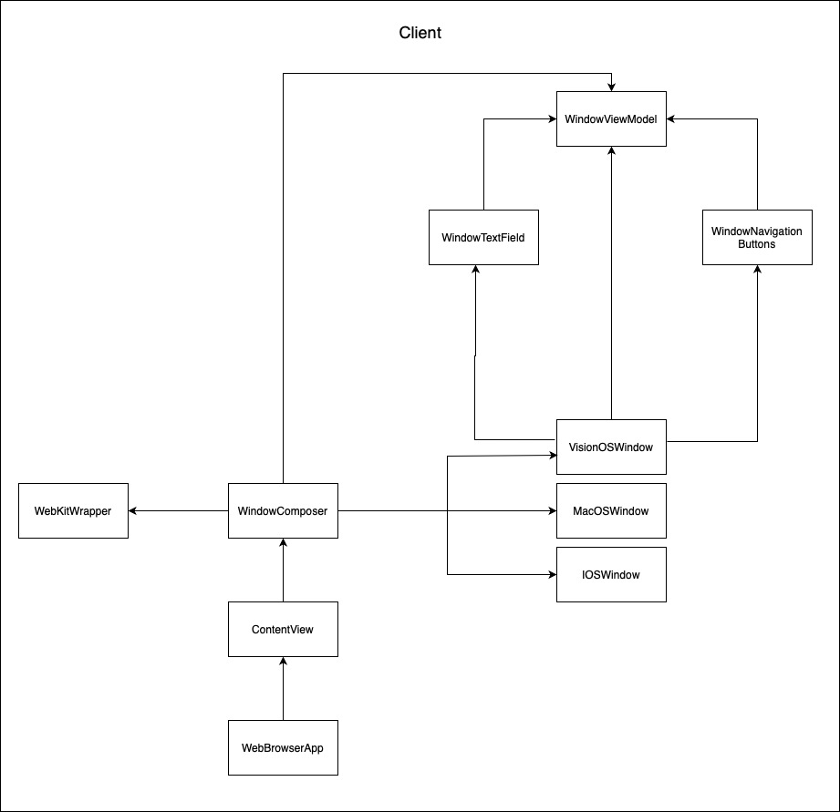
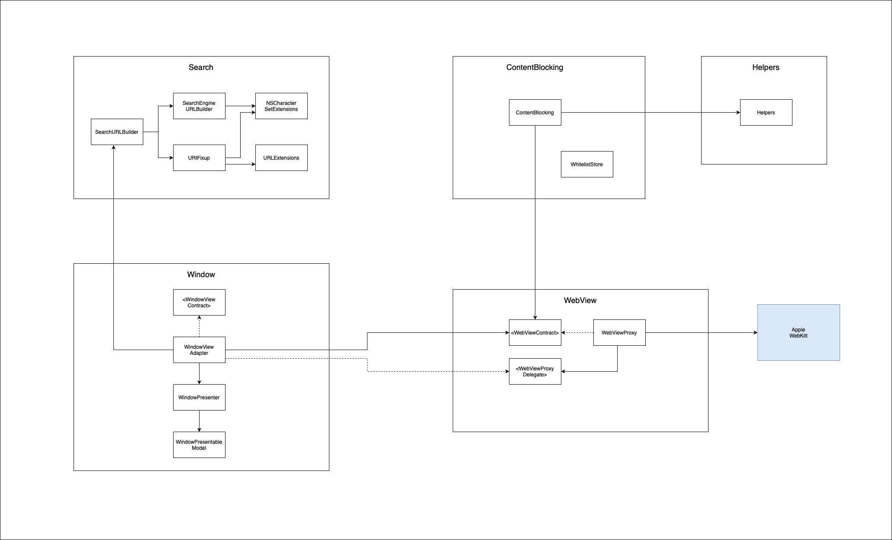

# web-browser

Web browser for iOS | macOS | visionOS

## Building the code

1. Install the latest Xcode developer tools from Apple.
2. Clone the repository.
3. Build the web-browser scheme in Xcode.

## Client App Architecture

## Core Library Architecture

